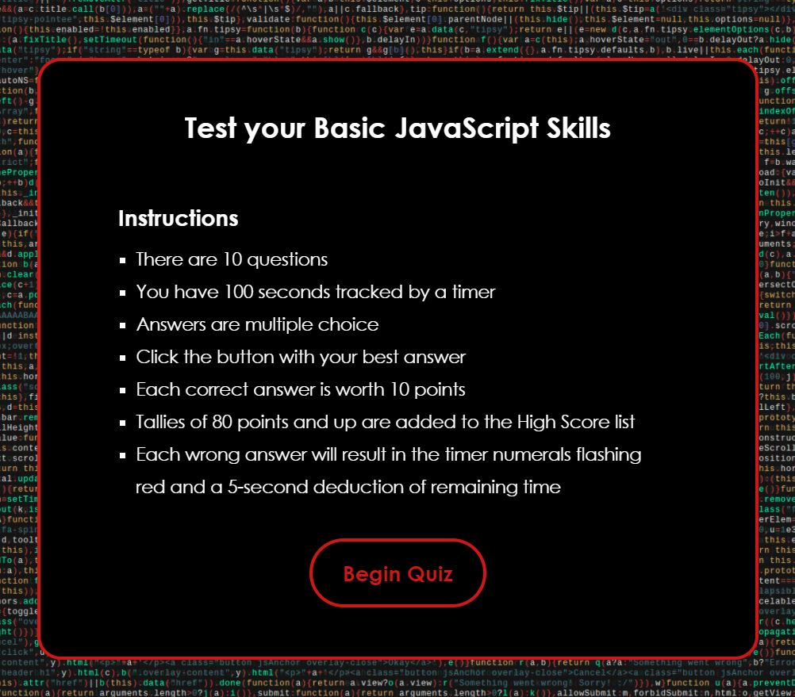
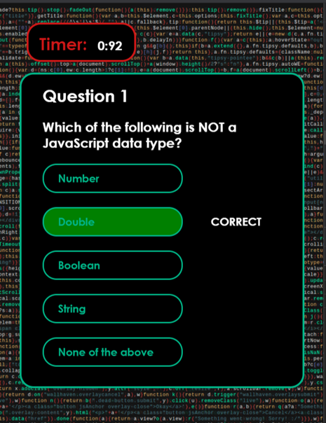
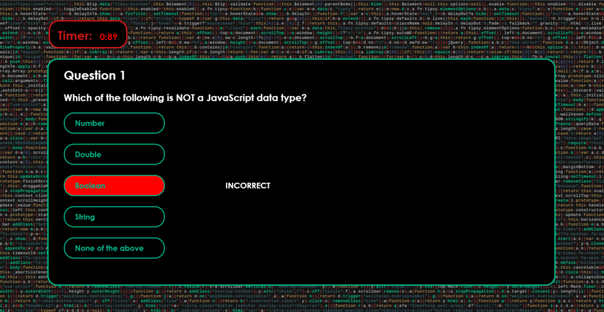
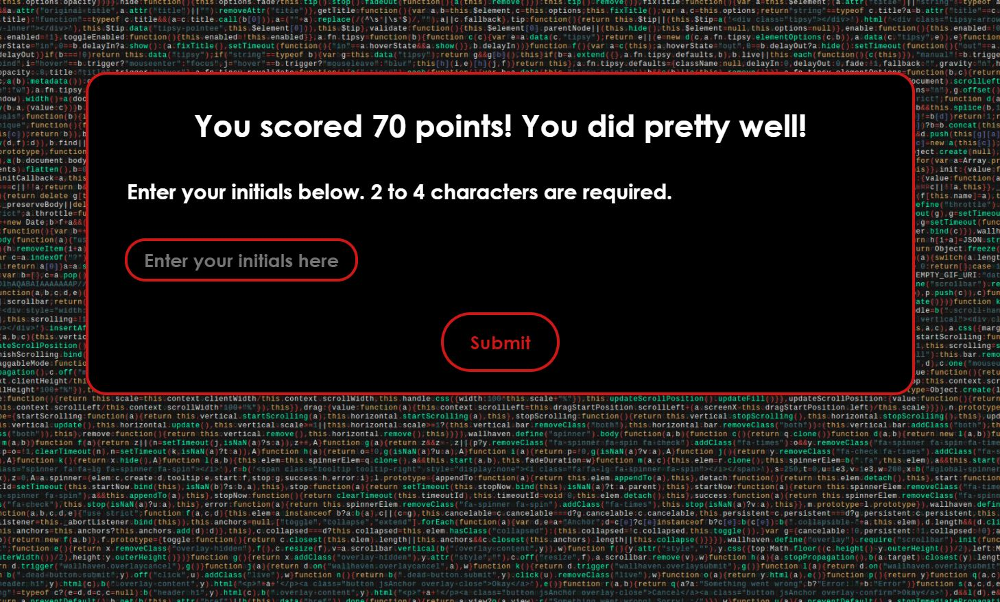
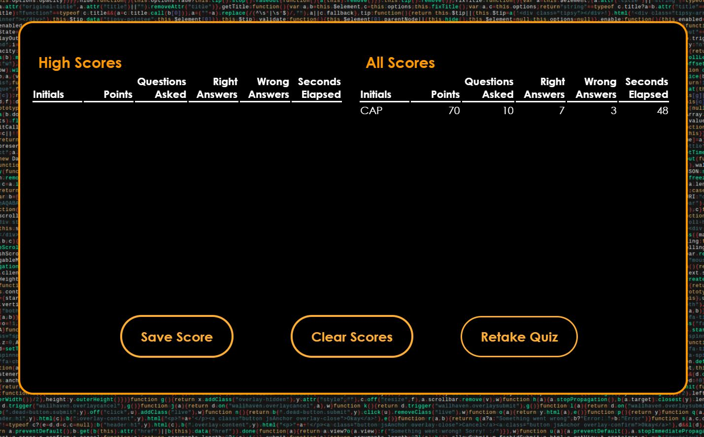
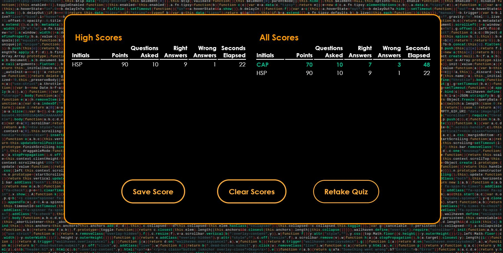

# 04 Web APIs: JavaScript Fundamentals Quiz

## User Story
*AS A coding boot camp student,
I WANT to take a timed quiz on JavaScript fundamentals that stores high scores SO THAT I can gauge my progress compared to my peers*

## © 2021, Lauren J. M. Kruse. All rights reserved.

## Description

### Build
* Program assembled using HTML, CSS, JavaScript code
* HTML and CSS dynamically updated via JavaScript
* I elected to create nearly all HTML elements via JavaScript
* Application deployed at live URL

### Purpose
* Application provides user with the means to test their knowledge of JavaScript fundamentals
* Scores displayed in two tables (All Scores and High Scores), enabling user to weigh performance against that of peers

### General Features
* Quiz timed; user allocated 100 seconds
* Questions are multiple choice; 5 possible answers per question
* Timer displays countdown of seconds
* For each incorrect answer, 5 seconds deducted from remaining time
* If user fails to click answer button for a question
  * Answer considered incorrect
  * Quiz will not advance to next question
  * Timer will run down to zero
* Each correct answer worth 10 points
* Scores tabulated with option to save

## Appearance
Application built entirely from scratch, including:
* All CSS styling
* Media queries accommodating four screen sizes:
  * Phone
  * Tablet
  * Small laptop screen
  * Large monitor
* Layout carefully designed
* Font and colors selected with special consideration
* Visual feedback a focal point

## Instructions and Process

### Instructions
* Instructions provided on Welcome Page:
  * Number of questions
  * Time allocated for quiz
  * Question format
  * How points accrued
  * Consequence of incorrect answer regarding timer

### Process
* On Welcome Page, click 'Begin Quiz' button
  * Welcome Page disappears
* Quiz Page appears
  * Timer displayed in upper-left corner
  * Countdown begins at 100 seconds
  * First of ten questions presented in window below timer
  * User clicks on answer button of choice
  * Upon click, answer feedback displayed via color and text
  * Quiz moves to next question
* When all questions answered, or timer reaches 0 (whichever happens first):
  * Quiz Page disappears
  * End-of-quiz message appears briefly
  * Message page disappears
* Form page appears:
  * Displays points earned
  * Conveys points message
  * User asked to enter initials
  * User enters initials and clicks 'Submit' button
  * Form page disappears
* Score page appears
  * User's score (identified by initials) appears in one or both tables
  * 'Save Score' button sends current record to local storage; user remains on Score page
  * 'Clear Scores' button removes all records from both tables and clears data from local storage; user remains on Score page
  * 'Retake Quiz' button returns user to Welcome page; quiz is reset

## Challenges Met and Experience Gained
* Building this application:
  * Enabled me to garner knowledge of wide array of CSS styles and techniques
  * Made evident importance of thoroughly reading appropriate documentation **prior to** implementation of methods, processes, etc.
  * Caused me to develop deep appreciation of time and effort necessary in building CSS styles and media queries from scratch
* Working with event listeners proved a challenge, as I learned how they may interfere with looping, data collection, function calls, etc. 

## Improvements
* This program is a work-in-progress. As my aptitude for CSS and JavaScript grows, I aim to:
  * Make the code more concise
  * Learn to better organize code and processes
  * Improve implementation and placement of functions
  * Fine-tune positioning of elements using CSS
* N.B.: Several lines of code can be pared down or eliminated; I struggled with event listeners that were affecting values and processes. Hence, I developed work-arounds prior to modifying the listeners themselves.

## Installation
* Installation not required; program runs in browser
* Deployed application may be found here: https://laurenjmkruse.github.io/Quiz-On-JavaScript-Fundamentals/

## Screenshots
Screenshots of application may be found at below links:
1.  Welcome page (tablet size)
    

1.  Quiz page with correct answer selected (phone size)
    

1.  Quiz page with incorrect answer selected (large monitor size)
    

1.  Quiz Over page (small laptop size)
    

1.  Time's Up page (phone size)
    

1.  Initials Form page (small laptop size)
    

1.  Scores Page - unsaved data (small laptop size)
   

1.  Scores Page - saved data (large monitor size)
    
 

## Special Features

### Quiz Page
* When user clicks on correct answer:
  * Target button turns green
  * Feedback message appears, reading, 'CORRECT'
* When user clicks on incorrect answer:
  * Target button turns red
  * Feedback message appears, reading, 'INCORRECT'
  * As 5 seconds are deducted from timer countdown, numerals flash red
* A brief delay is inserted with each answer button click to ensure user may view feedback
* When user clicks on an answer, all answer buttons disabled; this prevents errors and data miscalculations
* Buttons renabled for subsequent question

### End-of-Quiz Message
* Upon completion of quiz, user presented with message appropriate to performance:
  * If all questions answered, message is 'QUIZ OVER'
  * If timer runs out, message is 'TIME'S UP!'
* Brief delay ensures user has enough time to view message 

### Form Page
* When user notified of points earned, customized message appears (dependent upon points range achieved)
* When user enters initials, input checked; corrective instructions provided, as needed:
  * 2-character minimum
  * 4-character maximum
  * Letters only; neither numbers nor symbols permitted
* When user makes valid entry, input is modified, as appropriate:
  * Characters reformatted to all capitals
  * Spaces removed

### Score Page
* User's score saved to either one or two tables:
  * All Scores table
  * High Scores table (for 80+ points earned)
* Upon first viewing score, user will see their data displayed in white, non-bold font
* Upon clicking 'Save Score' button, current data will change to bold, green font
* Any data previously saved will appear in row(s) before current record, and will be rendered in bold, green font
* Each table record displays:
  * User's initials
  * Points earned
  * Number of questions asked
  * Number of correct answers
  * Number of incorrect answers
  * Seconds elapsed (how long it took user to take quiz)
* Buttons
  * 'Save Score' button - Enables user to save current record to local storage
  * 'Clear Scores' button - Will remove all records from both tables, and all data from local storage
  * 'Retake Quiz' button - Will return user to Welcome Page; quiz is reset

## Credits
To assemble this project, I relied upon the following:
* Coding Bootcamp classes taught by Michael Labieniec (my instructor)
* W3Schools: https://www.w3schools.com/
* MDN web docs: https://developer.mozilla.org/en-US/
JavaScript background was taken from Wallpaper Cave: https://wallpapercave.com/w/wp2465921

## License
A license does not apply.

## Testing
* Testing was incorporated in every stage of building this application:
  * Invalid data entered (for initials) to ensure appropriate handling
  * References checked
  * Values checked
  * Equations checked
  * Timer functionality checked
  * All possible scenarios checked 
* try...catch added to capture any errors and log them to console
